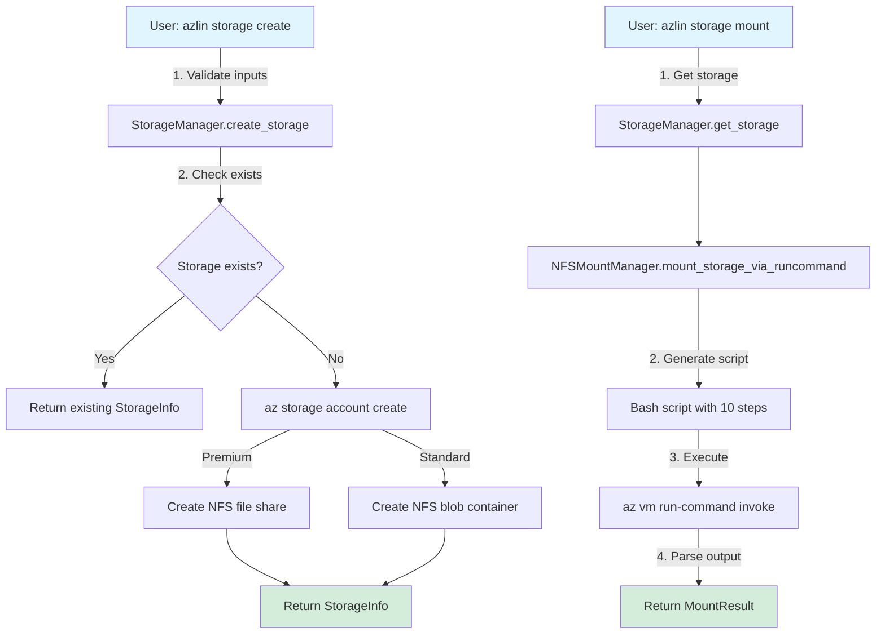
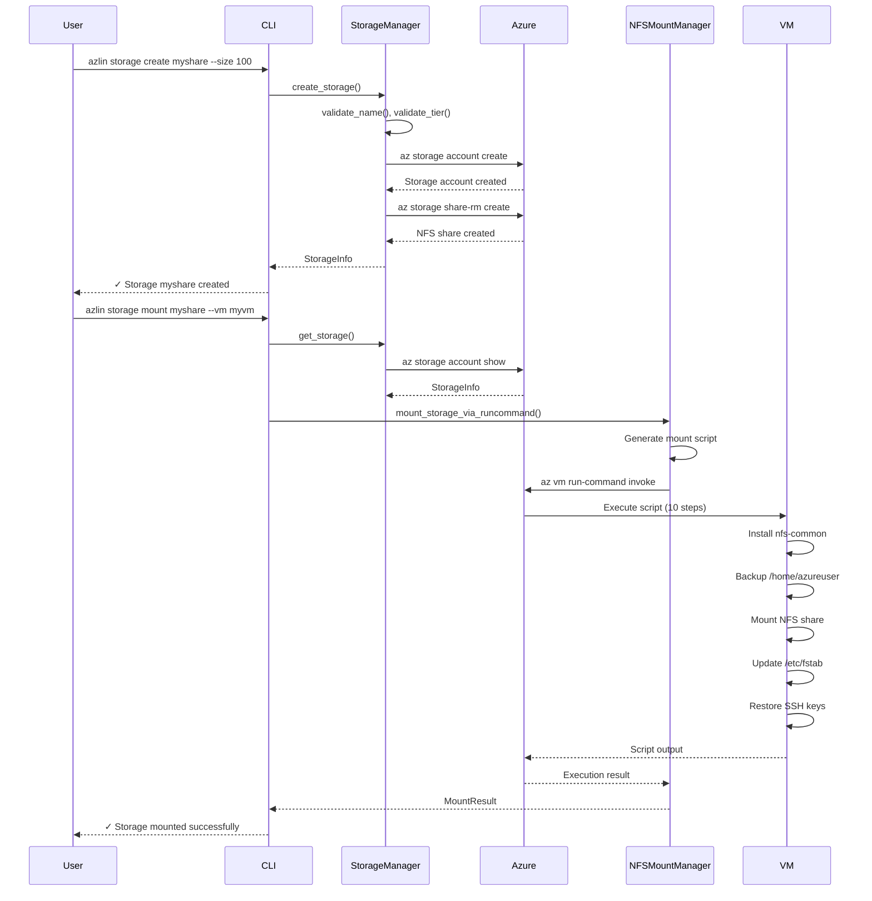
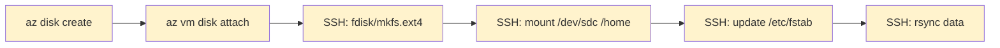
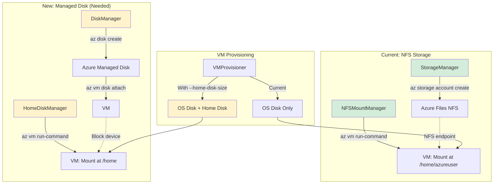

# Storage Architecture Analysis Report
**Date:** 2026-01-11
**Focus:** Azure Files NFS Storage Provisioning & Disk Operations
**Purpose:** Understand storage architecture to implement separate home disk feature (#514)

---

## Executive Summary

**Key Insight 1**: azlin uses Azure Files NFS for **shared storage**, not Azure Managed Disks. This is fundamentally different from the separate home disk requirement.

**Key Insight 2**: Current storage operations use `StorageManager` for creating NFS shares and `NFSMountManager` for mounting them on VMs via SSH/run-command.

**Key Insight 3**: The separate home disk feature will require **Azure Managed Disk** operations, which are NOT currently implemented. This is a net-new capability pattern.

---

## Documentation Discovery

**✓ Found**: 3 primary documentation files
- `docs/STORAGE_README.md` - User-facing storage commands
- `docs/NFS_STORAGE_IMPLEMENTATION.md` - Implementation summary
- `docs/ARCHITECTURE.md` - Overall system architecture

**Key Claims from Documentation**:
1. Storage uses Azure Files NFS with Premium/Standard tiers
2. Mount operations replace `/home/azureuser` directory
3. Storage is provisioned **separately** from VM creation
4. VMs can share storage via mounting same NFS endpoint

**Documentation Gaps**:
- No mention of Azure Managed Disks
- No disk attachment workflow documented
- No `/home` mounting strategy (only full replacement)

---

## Storage Manager Architecture

### Module Overview

**File**: `src/azlin/modules/storage_manager.py` (864 lines)

**Philosophy**:
- Uses Azure CLI (`az storage account`) exclusively
- No credentials in code (delegates to CLI)
- Validates all inputs before Azure calls
- Returns structured data (dataclasses)
- Fail fast with clear error messages

**Public API**:
```python
__all__ = [
    "StorageError",          # Base exception
    "StorageInUseError",     # Storage has connected VMs
    "StorageInfo",           # Storage account information
    "StorageManager",        # Main operations class
    "StorageNotFoundError",  # Storage not found
    "StorageStatus",         # Detailed storage status
    "ValidationError",       # Invalid input parameters
]
```

### Key Data Models

```python
@dataclass
class StorageInfo:
    """Storage account information."""
    name: str
    resource_group: str
    region: str
    tier: str  # "Premium" or "Standard"
    size_gb: int
    nfs_endpoint: str  # e.g., "name.file.core.windows.net:/sharename"
    created: datetime

@dataclass
class StorageStatus:
    """Detailed storage status."""
    info: StorageInfo
    used_gb: float
    utilization_percent: float
    connected_vms: list[str]  # VM names
    cost_per_month: float
```

### Core Operations

#### 1. Create Storage Account

```python
@classmethod
def create_storage(
    cls,
    name: str,
    resource_group: str,
    region: str,
    tier: str = "Premium",
    size_gb: int = 100,
) -> StorageInfo:
```

**Implementation Details**:
```python
# Premium: Uses FileStorage with NFS file shares
if tier == "Premium":
    sku = "Premium_ZRS"
    kind = "FileStorage"
    cls._create_nfs_file_share(name, resource_group, "home", size_gb)
    nfs_endpoint = f"{name}.file.core.windows.net:/{name}/home"

# Standard: Uses StorageV2 with blob containers
else:
    sku = "Standard_LRS"
    kind = "StorageV2"
    cls._create_nfs_container(name, resource_group, "home")
    nfs_endpoint = f"{name}.blob.core.windows.net:/{name}/home"
```

**Azure CLI Command**:
```bash
az storage account create \
  --name <name> \
  --resource-group <rg> \
  --location <region> \
  --sku Premium_ZRS \
  --kind FileStorage \
  --allow-blob-public-access false \
  --https-only false \
  --default-action Deny \
  --tags managed-by=azlin
```

#### 2. Configure Network Access (NFS Requirement)

```python
@classmethod
def configure_nfs_network_access(
    cls,
    storage_account: str,
    resource_group: str,
    vm_subnet_id: str,
) -> None:
```

**Steps**:
1. Enable `Microsoft.Storage` service endpoint on VM subnet
2. Add subnet to storage account network rules
3. Set default action to "Deny" (VNet-only access)

**Security**: NFS endpoints only accessible within Azure VNet

---

## NFS Mount Manager Architecture

### Module Overview

**File**: `src/azlin/modules/nfs_mount_manager.py` (1,140 lines)

**Philosophy**:
- Remote operations via SSH
- Atomic mount/unmount (rollback on failure)
- Preserves user data (backup before mount)
- Updates `/etc/fstab` for persistence
- Fail fast with clear error messages

**Security**:
- All user inputs validated before shell commands
- Protection against command injection
- Safe path handling with character whitelisting

### Key Data Models

```python
@dataclass
class MountResult:
    """Result of mount operation."""
    success: bool
    mount_point: str
    nfs_endpoint: str
    backed_up_files: int = 0
    copied_files: int = 0
    errors: list[str] = field(default_factory=list)

@dataclass
class MountInfo:
    """Current mount information."""
    mount_point: str
    nfs_endpoint: str
    filesystem_type: str
    mount_options: str
```

### Mount Operation Flow

#### Method: `mount_storage_via_runcommand`

**Why run-command?** Azure's waagent continuously overwrites SSH keys every 10-30 seconds, breaking SSH-based operations. Run-command bypasses this limitation.

**Complete Script (Executed in Single Azure Run-Command)**:

```bash
#!/bin/bash
set -e

# Step 1: Wait for package manager (up to 60s)
for i in {1..30}; do
    if ! fuser /var/lib/dpkg/lock-frontend >/dev/null 2>&1; then
        break
    fi
    sleep 2
done

# Step 2: Install nfs-common
export DEBIAN_FRONTEND=noninteractive
apt-get update -qq
apt-get install -y nfs-common

# Step 3: Backup existing mount point
if [ -d "{mount_point}" ] && [ "$(ls -A {mount_point} 2>/dev/null)" ]; then
    mv "{mount_point}" "{mount_point}.backup"
fi

# Step 4: Create mount point
mkdir -p "{mount_point}"

# Step 5: Mount NFS share
mount -t nfs -o vers=4,minorversion=1,sec=sys {nfs_endpoint} {mount_point}

# Step 6: Update /etc/fstab
echo "{nfs_endpoint} {mount_point} nfs vers=4,minorversion=1,sec=sys 0 0" >> /etc/fstab

# Step 7: Fix ownership
chown azureuser:azureuser "{mount_point}"
chmod 755 "{mount_point}"

# Step 8: Restore SSH keys
mkdir -p "{mount_point}/.ssh"
cat > "{mount_point}/.ssh/authorized_keys" << 'SSHKEY'
{ssh_public_key}
SSHKEY
chmod 600 "{mount_point}/.ssh/authorized_keys"

# Step 9: Copy backup if share empty
if [ "$BACKED_UP_FILES" -gt 0 ] && [ "$SHARE_FILES" -eq 0 ]; then
    cp -a "{mount_point}.backup"/* "{mount_point}"/
fi
```

**Azure CLI Execution**:
```bash
az vm run-command invoke \
  --resource-group <rg> \
  --name <vm-name> \
  --command-id RunShellScript \
  --scripts "<script>"
```

---

## NFS Provisioner Architecture

### Module Overview

**File**: `src/azlin/modules/nfs_provisioner.py` (1,205 lines)

**Purpose**: Cross-region NFS access via private endpoints and VNet peering

**Key Capabilities**:
- Analyze NFS access strategy (direct, private endpoint, new storage)
- Create private endpoints for cross-region access
- Setup VNet peering between regions
- Configure private DNS zones
- Replicate data between storage accounts (azcopy)

**Access Strategies**:
```python
class AccessStrategy(Enum):
    DIRECT = "direct"                    # Same region
    PRIVATE_ENDPOINT = "private_endpoint"  # Cross-region
    NEW_STORAGE = "new_storage"          # Create new storage
    REPLICATE = "replicate"              # New + data replication
```

---

## VM Provisioning Architecture

### Module Overview

**File**: `src/azlin/vm_provisioning.py` (1,000+ lines)

**Key Discovery**: VMs are created with **standard OS disk only**. No data disks attached during provisioning.

### VM Creation Command

```python
def _try_provision_vm(self, config: VMConfig, ...) -> VMDetails:
    cmd = [
        "az", "vm", "create",
        "--name", config.name,
        "--resource-group", config.resource_group,
        "--location", config.location,
        "--size", config.size,
        "--image", config.image,
        "--admin-username", config.admin_username,
        "--authentication-type", "ssh",
        "--ssh-key-values", config.ssh_public_key,
        "--custom-data", cloud_init,
        "--public-ip-sku", "Standard" if config.public_ip_enabled else "",
        "--output", "json"
    ]
```

**No Data Disk Flags Present**:
- No `--data-disk-sizes-gb`
- No `--attach-data-disks`
- No `--data-disk-caching`

**This confirms**: azlin currently has **zero Azure Managed Disk** operations.

---

## Storage Flow Diagram



**Caption**: Two-layer flow shows storage creation (Azure Files NFS) and mounting (via run-command).

---

## NFS Storage Provisioning Flow



**Caption**: Complete NFS storage provisioning flow from creation to mounting.

---

## Current Storage vs. Separate Home Disk

### Current: Azure Files NFS (Shared Storage)

| Aspect | Implementation |
|--------|----------------|
| **Type** | Azure Files NFS (SMB-based) |
| **Purpose** | Shared home directories across VMs |
| **Mounting** | Replaces `/home/azureuser` entirely |
| **Persistence** | Via `/etc/fstab` entry |
| **Cost Model** | Per-GB storage (Premium: $0.1536/GB, Standard: $0.04/GB) |
| **Operations** | Create storage → Mount on VM |

### Required: Azure Managed Disk (Separate Home Disk)

| Aspect | Implementation (Needed) |
|--------|-------------------------|
| **Type** | Azure Managed Disk (block storage) |
| **Purpose** | Dedicated `/home` partition per VM |
| **Mounting** | Mount at `/home` (not `/home/azureuser`) |
| **Persistence** | Disk attached to VM (survives VM lifecycle) |
| **Cost Model** | Per-disk pricing (depends on size & tier) |
| **Operations** | Create disk → Attach to VM → Format → Mount |

---

## Azure Managed Disk Operations (Not Implemented)

### Required Workflow



**Caption**: Complete managed disk workflow. **Yellow = Not implemented in azlin**.

### Azure CLI Commands Needed

#### 1. Create Managed Disk
```bash
az disk create \
  --name azlin-home-<vm-name> \
  --resource-group <rg> \
  --location <region> \
  --size-gb 50 \
  --sku Premium_LRS \
  --output json
```

#### 2. Attach Disk to VM
```bash
az vm disk attach \
  --name azlin-home-<vm-name> \
  --resource-group <rg> \
  --vm-name <vm-name> \
  --output json
```

#### 3. Format and Mount (via SSH or run-command)
```bash
# Identify disk device
lsblk -o NAME,SIZE,TYPE,MOUNTPOINT

# Partition disk (if needed)
sudo fdisk /dev/sdc  # Or parted for GPT

# Format as ext4
sudo mkfs.ext4 /dev/sdc

# Create mount point
sudo mkdir -p /home

# Mount
sudo mount /dev/sdc /home

# Update /etc/fstab
echo "/dev/sdc /home ext4 defaults,nofail 0 2" | sudo tee -a /etc/fstab

# Copy data if needed
sudo rsync -av /home/ /mnt/temp-home-backup/
```

---

## Integration Points for Home Disk Feature

### 1. **VM Provisioning** (`vm_provisioning.py`)

**Current**: Creates VM with OS disk only

**Needed**: Add data disk creation/attachment during VM provisioning

```python
# In VMProvisioner._try_provision_vm()
if config.home_disk_size_gb > 0:
    # Create home disk
    home_disk = self._create_home_disk(
        vm_name=config.name,
        resource_group=config.resource_group,
        location=config.location,
        size_gb=config.home_disk_size_gb
    )

    # Attach to VM
    self._attach_home_disk(
        vm_name=config.name,
        resource_group=config.resource_group,
        disk_id=home_disk.id
    )
```

### 2. **Disk Manager Module** (New)

**File**: `src/azlin/modules/disk_manager.py` (to be created)

**Public API** (proposed):
```python
__all__ = [
    "DiskManager",      # Main operations class
    "DiskInfo",         # Disk information
    "DiskStatus",       # Detailed status
    "DiskError",        # Base exception
]

class DiskManager:
    @classmethod
    def create_disk(cls, name: str, resource_group: str,
                   region: str, size_gb: int) -> DiskInfo:
        """Create managed disk."""

    @classmethod
    def attach_disk(cls, disk_name: str, vm_name: str,
                   resource_group: str) -> bool:
        """Attach disk to VM."""

    @classmethod
    def detach_disk(cls, disk_name: str, vm_name: str,
                   resource_group: str) -> bool:
        """Detach disk from VM."""

    @classmethod
    def delete_disk(cls, disk_name: str, resource_group: str) -> bool:
        """Delete managed disk."""
```

### 3. **Home Disk Mount Manager** (New)

**File**: `src/azlin/modules/home_disk_manager.py` (to be created)

**Purpose**: Format, mount, and configure home disk on VM

```python
class HomeDiskManager:
    @classmethod
    def format_and_mount_home_disk(
        cls,
        vm_ip: str,
        ssh_key: Path,
        device: str = "/dev/sdc",
        mount_point: str = "/home"
    ) -> MountResult:
        """Format disk and mount at /home."""

        # 1. Detect device
        # 2. Partition if needed
        # 3. Format as ext4
        # 4. Mount at /home
        # 5. Update /etc/fstab
        # 6. Migrate data if needed
```

### 4. **CLI Integration** (`cli.py`)

**New Flag**:
```python
@click.option(
    "--home-disk-size",
    type=int,
    default=0,
    help="Size of separate /home disk in GB (0 = no separate disk)"
)
def new_command(..., home_disk_size: int):
    """Create new VM with optional separate home disk."""
```

---

## Recommendations for Implementation

### Phase 1: Core Disk Operations

1. **Create `DiskManager` module** following `StorageManager` pattern
   - Use `az disk create` for disk creation
   - Use `az vm disk attach` for attachment
   - Implement validation and error handling

2. **Create `HomeDiskManager` module** following `NFSMountManager` pattern
   - Use `az vm run-command invoke` for formatting/mounting
   - Handle partition detection (`lsblk`)
   - Support ext4 filesystem only (simplest, most reliable)

### Phase 2: VM Provisioning Integration

1. **Extend `VMConfig` dataclass**
   ```python
   @dataclass
   class VMConfig:
       ...
       home_disk_size_gb: int = 0  # New field
   ```

2. **Add disk workflow to `_try_provision_vm()`**
   - Create disk after VM creation
   - Attach disk to VM
   - Format and mount via run-command
   - Migrate `/home/azureuser` if needed

### Phase 3: Lifecycle Operations

1. **VM Destroy**: Optionally delete home disk
2. **VM Stop/Start**: Disk persists (no action needed)
3. **Disk Resize**: Support expanding disk size

### Code Example: Complete Home Disk Setup

```python
# In vm_provisioning.py
def _setup_home_disk(self, vm_name: str, resource_group: str,
                     location: str, size_gb: int, vm_ip: str,
                     ssh_key: Path) -> None:
    """Setup separate home disk for VM."""

    # 1. Create managed disk
    disk_name = f"azlin-home-{vm_name}"
    disk_info = DiskManager.create_disk(
        name=disk_name,
        resource_group=resource_group,
        region=location,
        size_gb=size_gb
    )

    # 2. Attach to VM
    DiskManager.attach_disk(
        disk_name=disk_name,
        vm_name=vm_name,
        resource_group=resource_group
    )

    # 3. Format and mount
    result = HomeDiskManager.format_and_mount_home_disk(
        vm_ip=vm_ip,
        ssh_key=ssh_key,
        device="/dev/sdc",  # Azure data disks start at sdc
        mount_point="/home"
    )

    if not result.success:
        raise ProvisioningError(f"Failed to mount home disk: {result.errors}")
```

---

## Key Differences: NFS Storage vs. Managed Disk

| Feature | NFS Storage (Current) | Managed Disk (Needed) |
|---------|----------------------|----------------------|
| **Sharing** | Multiple VMs can share | One disk per VM |
| **Mount Point** | Replaces `/home/azureuser` | Mounts at `/home` |
| **Persistence** | Network-based (always available) | Block storage (attached to VM) |
| **Performance** | Network latency | Direct-attached (faster) |
| **Cost** | Per-GB storage fees | Per-disk + per-GB fees |
| **Lifecycle** | Independent of VM | Can be retained after VM deletion |
| **Implementation** | `StorageManager` + `NFSMountManager` | `DiskManager` + `HomeDiskManager` (new) |

---

## Security Considerations

### Input Validation (Critical)

Both `DiskManager` and `HomeDiskManager` must validate:
- Disk names (alphanumeric, hyphens, underscores)
- VM names (Azure naming rules)
- Resource IDs (proper format)
- Device paths (whitelist: `/dev/sdc`, `/dev/sdd`, etc.)
- Mount points (absolute paths, no shell metacharacters)

### Command Injection Prevention

```python
# BAD - Vulnerable to injection
cmd = f"sudo mount /dev/{device} {mount_point}"

# GOOD - Validated inputs
device = _validate_device_path(device)  # Whitelist check
mount_point = _validate_mount_point(mount_point)  # Pattern check
cmd = ["sudo", "mount", f"/dev/{device}", mount_point]
```

---

## Cost Implications

### Azure Managed Disk Pricing (Example: West US 2)

| Disk Type | Size | Monthly Cost |
|-----------|------|--------------|
| Premium SSD (P10) | 128 GB | $19.71 |
| Premium SSD (P6) | 64 GB | $9.86 |
| Standard SSD (E10) | 128 GB | $9.60 |
| Standard HDD (S10) | 128 GB | $5.89 |

**Recommendation**: Use **Standard SSD (E10, 128GB)** for `/home` disks
- Cost: ~$9.60/month
- Performance: Adequate for home directory usage
- Balance: Good cost/performance ratio

### Comparison with NFS Storage

**50GB Home Disk (Standard SSD)**:
- Disk cost: ~$3.84/month
- **Total**: $3.84/month per VM

**50GB NFS Storage (Standard)**:
- Storage cost: $2.00/month (50GB × $0.04/GB)
- **Shared** across multiple VMs
- **Total**: $2.00/month for all VMs

**Recommendation**: Offer both options:
- `--home-disk-size 50` → Managed disk (isolated)
- `--nfs-storage myshare` → NFS storage (shared)

---

## Architecture Diagram: Complete Storage System



**Caption**: Complete storage architecture showing current NFS storage (green) and needed managed disk operations (yellow).

---

## Conclusion

### Summary of Findings

1. **azlin currently has ZERO Azure Managed Disk operations**
   - All storage is Azure Files NFS (network-based)
   - No disk creation, attachment, or formatting code exists

2. **NFS storage architecture is well-established**
   - `StorageManager`: Handles Azure Files NFS accounts
   - `NFSMountManager`: Mounts shares via run-command
   - Proven pattern for shared storage use case

3. **Separate home disk requires net-new capabilities**
   - `DiskManager` module (create, attach, detach, delete)
   - `HomeDiskManager` module (format, mount, migrate)
   - Integration with VM provisioning workflow

4. **Implementation follows existing patterns**
   - Brick-style modules with clear public APIs
   - Azure CLI for all operations
   - Run-command for VM configuration
   - Comprehensive input validation

### Recommended Approach

1. **Create `DiskManager`** following `StorageManager` pattern
2. **Create `HomeDiskManager`** following `NFSMountManager` pattern
3. **Extend `VMProvisioner`** to support home disk workflow
4. **Add CLI flag** `--home-disk-size` to `azlin new` command
5. **Test thoroughly** with multiple VM sizes and regions

### Next Steps

1. **Phase 1**: Implement `DiskManager` module (disk CRUD operations)
2. **Phase 2**: Implement `HomeDiskManager` module (format/mount/migrate)
3. **Phase 3**: Integrate with VM provisioning workflow
4. **Phase 4**: Add CLI flags and user documentation
5. **Phase 5**: End-to-end testing with real VMs

---

## Appendix: Code References

### Key Files Analyzed

1. **Storage Manager**: `src/azlin/modules/storage_manager.py` (864 lines)
2. **NFS Mount Manager**: `src/azlin/modules/nfs_mount_manager.py` (1,140 lines)
3. **NFS Provisioner**: `src/azlin/modules/nfs_provisioner.py` (1,205 lines)
4. **VM Provisioning**: `src/azlin/vm_provisioning.py` (1,000+ lines)

### Relevant Documentation

1. **User Guide**: `docs/STORAGE_README.md`
2. **Implementation Summary**: `docs/NFS_STORAGE_IMPLEMENTATION.md`
3. **System Architecture**: `docs/ARCHITECTURE.md`

### Azure CLI Commands to Research

```bash
# Managed Disk Operations
az disk create --help
az disk list --help
az disk show --help
az disk delete --help
az vm disk attach --help
az vm disk detach --help

# VM Operations
az vm show --help
az vm run-command invoke --help
```

---

**End of Report**
