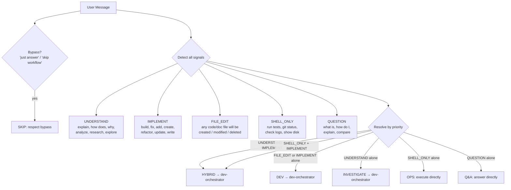

# Amplihack Agents

<!-- AMPLIHACK_CONTEXT_START -->

## 🎯 USER PREFERENCES (MANDATORY - MUST FOLLOW)

## Amplihack Copilot Workflow Rules

For any DEV, INVESTIGATE, or HYBRID request, invoke `Skill(skill="dev-orchestrator")` immediately.

After the skill is activated, the next tool call must execute the `smart-orchestrator` recipe via `run_recipe_by_name("smart-orchestrator")`.

Do not follow the workflow manually and do not fall back to legacy `ultrathink` behavior.

## Auto-routing prompt

<system-reminder source="auto-intent-router">
Before responding, classify this prompt using parallel signal evaluation:



Resolution rules — detect all signals, then apply the FIRST matching rule:
1. BYPASS → SKIP
2. UNDERSTAND + IMPLEMENT both present → **HYBRID** (even if FILE_EDIT also present)
3. SHELL_ONLY + IMPLEMENT both present → **HYBRID** (run command then fix)
4. FILE_EDIT or IMPLEMENT present (no UNDERSTAND) → **DEV**
5. UNDERSTAND present (no IMPLEMENT) → **INVESTIGATE**
6. SHELL_ONLY present (no FILE_EDIT) → **OPS**
7. QUESTION present (no FILE_EDIT) → **Q&A**
8. Ambiguous → **DEV** (safe default)

Calibration examples (use these to resolve edge cases):
  "run tests and fix failures" = HYBRID (SHELL_ONLY + IMPLEMENT → both phases)
  "investigate X then fix Y" = HYBRID
  "what does this error mean and how do I fix it" = HYBRID (UNDERSTAND + IMPLEMENT)
  "change the default model" = DEV. "update README" = DEV. "fix a typo" = DEV.
  "review this PR" = DEV. "make sure it works" = DEV. "write docs" = DEV.
  "run tests" = OPS. "git status" = OPS.
  "what is OAuth?" = Q&A. "how does X work?" = Q&A (no fix requested).
  "what's broken?" = INVESTIGATE. "why is CI failing?" = INVESTIGATE.
  "research rate limiting then implement it" = HYBRID.
  "analyze deps and remove circular imports" = HYBRID (UNDERSTAND + IMPLEMENT).

Actions:
  DEV → Say "[auto-routed] DEV → launching dev-orchestrator" then Invoke Skill(skill="dev-orchestrator"). Do not answer inline.
  INVESTIGATE → Say "[auto-routed] INVESTIGATE → launching dev-orchestrator" then Invoke Skill(skill="dev-orchestrator"). Do not answer inline.
  HYBRID → Say "[auto-routed] HYBRID → launching dev-orchestrator" then Invoke Skill(skill="dev-orchestrator"). Do not answer inline.
  Q&A → Answer directly. No workflow needed.
  OPS → Execute directly. No workflow needed.
  SKIP → Respect the bypass.

When in doubt, choose DEV. False positive costs minutes. False negative costs quality.
</system-reminder>

## Execution Instructions

**YOUR NEXT ACTION after reading this skill MUST include a Bash tool call that
executes `run_recipe_by_name("smart-orchestrator")`.** If your runtime requires
a `report_intent` call (e.g. Copilot CLI), emit it **in parallel** with the
Bash launch — both tool calls in the same response. The constraint is that no
_other_ substantive action (reading files, calling TodoWrite, invoking Agent,
or typing a response) may precede or replace the Bash launch.

If you find yourself doing anything else instead of launching the recipe
runner, you are bypassing the workflow. Stop. Go back. Run the recipe runner.

Development and Investigation tasks have exactly ONE execution path: the
recipe runner. There is no "Option B." There is no "I'll follow the steps
manually." There is no "Let me just quickly..." The recipe runner IS the
workflow. Skipping it means skipping the 23-step process, the recursion
guards, the goal verification, and the quality gates that exist for a reason.

A PostToolUse hook monitors every tool call after this skill activates. If
it detects 3 tool calls without recipe runner evidence, it will fire a hard
WARNING. Do not wait for the warning — run the recipe runner immediately.

When this skill is activated:

### REQUIRED: Execute via Recipe Runner — IMMEDIATELY

Your next tool call(s) must include the recipe runner launch (alongside
`report_intent` if your runtime requires it).

#### Default: Direct Execution

The recipe runner is a plain subprocess — it does **not** require tmux.
Call `run_recipe_by_name()` directly:

```bash
cd /path/to/repo && env -u CLAUDECODE \
  AMPLIHACK_HOME=/path/to/amplihack PYTHONPATH=src \
  python3 -c "
from amplihack.recipes import run_recipe_by_name

result = run_recipe_by_name(
    'smart-orchestrator',
    user_context={
        'task_description': '''TASK_DESCRIPTION_HERE''',
        'repo_path': '.',
    },
    progress=True,
)
print(f'Recipe result: {result}')
"
```

**Key points:**

- `PYTHONPATH=src python3` — uses the interpreter on PATH while forcing imports from the checked-out repo source tree (do NOT hardcode `.venv/bin/python`)
- `run_recipe_by_name` — delegates to the Rust binary via `subprocess.Popen`; no tmux involved
- `progress=True` — streams recipe-runner stderr live so you see nested step activity
- The recipe runner manages its own child processes (agent sessions, bash steps) as direct subprocesses

This is the preferred execution mode for most scenarios. It is simpler, has
no external dependencies beyond Python and the Rust binary, works on all
platforms, and makes output capture straightforward.

#### Durable Execution (tmux) — optional

Use tmux **only** when:

- The agent runtime may kill background processes after a timeout (e.g., some
  Claude Code hosted environments)
- You need to survive SSH disconnects or terminal closures
- You want to detach and monitor a long-running recipe interactively

```bash
LOG_FILE=$(mktemp /tmp/recipe-runner-output.XXXXXX.log)
SCRIPT_FILE=$(mktemp /tmp/recipe-runner-script.XXXXXX.py)
chmod 600 "$LOG_FILE" "$SCRIPT_FILE"
cat > "$SCRIPT_FILE" << 'RECIPE_SCRIPT'
from amplihack.recipes import run_recipe_by_name

result = run_recipe_by_name(
    "smart-orchestrator",
    user_context={
        "task_description": """TASK_DESCRIPTION_HERE""",
        "repo_path": ".",
    },
    progress=True,
)
print(f"Recipe result: {result}")
RECIPE_SCRIPT
tmux new-session -d -s recipe-runner \
  "cd /path/to/repo && env -u CLAUDECODE \
   AMPLIHACK_HOME=/path/to/amplihack PYTHONPATH=src \
   python3 $SCRIPT_FILE 2>&1 | tee $LOG_FILE"
echo "Recipe runner log: $LOG_FILE"
```

- The Python payload is written to a temp script to avoid nested quoting
  issues that cause silent launch failures (see issue #3215)
- `chmod 600 "$LOG_FILE" "$SCRIPT_FILE"` — keeps both files private
- `tmux new-session -d` — detached session, no timeout, survives disconnects
- Monitor with: `tail -f "$LOG_FILE"` or `tmux attach -t recipe-runner`

**Restarting a stale tmux session**: Some runtimes (e.g. Copilot CLI) block
`tmux kill-session` because it does not target a numeric PID. Use one of these
shell-policy-safe alternatives instead:

```bash
# Option A (preferred): use a unique session name per run to avoid collisions
tmux new-session -d -s "recipe-$(date +%s)" "..."

# Option B: locate the tmux server PID and terminate with numeric kill
tmux list-sessions -F '#{pid}' 2>/dev/null | xargs -I{} kill {}

# Option C: let tmux itself handle it — send exit to all panes
tmux send-keys -t recipe-runner "exit" Enter 2>/dev/null; sleep 1
```

If using Option A, update the `tail -f` / `tmux attach` commands to use the
same session name.

**The recipe runner is the required execution path for Development and
Investigation tasks.** Always try `smart-orchestrator` first.

**Required environment variables** for the recipe runner:

- `AMPLIHACK_HOME` — must point to the amplihack repo root (e.g.,
  `/home/user/src/amplihack`). The recipe runner uses this to find
  `amplifier-bundle/tools/orch_helper.py` and other orchestrator scripts.
- Preserve `AMPLIHACK_AGENT_BINARY` — nested workflow agents read this env var
  to stay on the caller's active binary (for example, Copilot in Copilot CLI).
  The Python wrapper no longer forwards the removed `--agent-binary` CLI flag,
  so keeping this env var set is now the correct behavior.
- Unset `CLAUDECODE` — required so nested Claude Code sessions can launch.

**Fallback: Direct recipe invocation when smart-orchestrator fails.**

Always try `smart-orchestrator` first — it handles classification, decomposition,
and routing automatically. However, if `smart-orchestrator` fails at the
**infrastructure level** (e.g., 0 workstreams from decomposition, missing env
vars, Rust binary version mismatch), you MAY invoke the specific workflow
recipe directly based on your classification:

| Classification | Direct Recipe            | When to Use                             |
| -------------- | ------------------------ | --------------------------------------- |
| Investigation  | `investigation-workflow` | smart-orchestrator decomposition failed |
| Development    | `default-workflow`       | smart-orchestrator decomposition failed |
| Q&A (complex)  | `qa-workflow`            | Q&A needing multi-step research         |
| Consensus      | `consensus-workflow`     | Critical decisions needing validation   |

Example:

```python
run_recipe_by_name("investigation-workflow", user_context={
    'task_description': task, 'repo_path': '.',
}, progress=True)
```

This is NOT a license to bypass `smart-orchestrator`. Only use direct
invocation after `smart-orchestrator` has failed at an infrastructure level
(not because the task seems "too simple" or "too specific").

**Handling hollow success** (recipe completes but agents produce no findings):

If a recipe returns SUCCESS but the agent outputs indicate the agents could
not access the codebase or produced empty/generic results (e.g., "no codebase
exists", "cannot proceed without a target"), this is a **hollow success**.
In this case:

1. Check that `repo_path` and `AMPLIHACK_HOME` are correct
2. Verify the working directory is the repo root
3. Retry with explicit file paths in the `task_description`
4. If retries also produce hollow results, report the infrastructure
   failure to the user with specifics

**Common rationalizations that are NOT acceptable:**

- "Let me first understand the codebase" — the recipe does that in Step 0
- "I'll follow the workflow steps manually" — NO, the recipe enforces them
- "The recipe runner might not work" — try it first, report errors if it fails
- "This is a simple task" — simple or complex, the recipe runner handles both
- "The recipe succeeded but didn't do anything useful, so I'll do it myself"
  — this is hollow success; retry with better context first

**Q&A and Operations only** may bypass the recipe runner:

- Q&A: Respond directly (analyzer agent)
- Operations: Builder agent (direct execution, no workflow steps)

### Error Recovery: Adaptive Strategy (NOT Degradation)

When `smart-orchestrator` fails, **failures must be visible and surfaced** —
never swallowed or silently degraded. The recipe handles error recovery
automatically via its built-in adaptive strategy steps, but if you observe
a failure outside the recipe, follow this protocol:

**1. Surface the error with full context:**

Report the exact error, the step that failed, and the log output. Never say
"something went wrong" — always include the specific failure details.

**2. File a bug with reproduction details:**

For infrastructure failures (import errors, missing env vars, binary not found,
decomposition producing invalid output), file a GitHub issue:

```bash
gh issue create \
  --title "smart-orchestrator infrastructure failure: <one-line summary>" \
  --body "<full error context, reproduction command, env details>" \
  --label "bug"
```

**3. Evaluate alternative strategies:**

If `smart-orchestrator` fails at the infrastructure level (not because the task
is wrong), you MAY invoke the specific workflow recipe directly. This is an
**adaptive strategy** — it must be announced explicitly, not done silently:

| Classification | Direct Recipe            | When Permitted                                      |
| -------------- | ------------------------ | --------------------------------------------------- |
| Investigation  | `investigation-workflow` | smart-orchestrator failed at parse/decompose/launch |
| Development    | `default-workflow`       | smart-orchestrator failed at parse/decompose/launch |

Example:

```python
# ANNOUNCE the strategy change first — never do this silently
print("[ADAPTIVE] smart-orchestrator failed at parse-decomposition: <error>")
print("[ADAPTIVE] Switching to direct investigation-workflow invocation")
run_recipe_by_name("investigation-workflow", user_context={...}, progress=True)
```

**This is NOT a license to bypass smart-orchestrator.** Always try it first.
Direct invocation is only permitted when smart-orchestrator fails at the
infrastructure level. "The task seems simple" is NOT an infrastructure failure.

**4. Detect hollow success:**

A recipe can complete structurally (all steps exit 0) but produce empty or
meaningless results — agents reporting "no codebase found" or reflection
marking ACHIEVED when no work was done. After execution, check that:

- Round results contain actual findings or code changes (not "I could not access...")
- PR URLs or concrete outputs are present for Development tasks
- At least one success criterion was verifiably evaluated

If results are hollow, report this to the user with the specific empty outputs.
Do not declare success when agents produced no meaningful work.

### Required Environment Variables

The recipe runner requires these environment variables to function:

| Variable                   | Purpose                                           | Default         |
| -------------------------- | ------------------------------------------------- | --------------- |
| `AMPLIHACK_HOME`           | Root of amplihack installation (for asset lookup) | Auto-detected   |
| `AMPLIHACK_AGENT_BINARY`   | Which agent binary to use (claude, copilot, etc.) | Set by launcher |
| `AMPLIHACK_MAX_DEPTH`      | Max recursion depth for nested sessions           | `3`             |
| `AMPLIHACK_NONINTERACTIVE` | Set to `1` to skip interactive prompts            | Unset           |

If `AMPLIHACK_HOME` is not set and auto-detection fails, `parse-decomposition`
and `activate-workflow` will fail with "orch_helper.py not found". Set it to
the directory containing `amplifier-bundle/`.

### After Execution: Reflect and verify

After execution completes, verify the goal was achieved. If not:

- For missing information: ask the user
- For fixable gaps: re-invoke with the remaining work description
- For infrastructure failures: file a bug and try adaptive strategy

### Enforcement: PostToolUse Workflow Guard

A PostToolUse hook (`workflow_enforcement_hook.py`) actively monitors every
tool call after this skill is invoked. It tracks:

- Whether `/dev` or `dev-orchestrator` was called (sets a flag)
- Whether the recipe runner was actually executed (clears the flag)
- How many tool calls have passed without workflow evidence

If 3+ tool calls pass without evidence of recipe runner execution, the hook
emits a hard WARNING. This is not a suggestion — it means you are violating
the mandatory workflow. State is stored in `/tmp/amplihack-workflow-state/`.

## User Preferences

# User Preferences

**MANDATORY**: These preferences MUST be followed by all agents. Priority #2 (only explicit user requirements override).

## Autonomy

Work autonomously. Follow workflows without asking permission between steps. Only ask when truly blocked on critical missing information.

## Core Preferences

| Setting             | Value                      |
| ------------------- | -------------------------- |
| Verbosity           | balanced                   |
| Communication Style | (not set)                  |
| Update Frequency    | regular                    |
| Priority Type       | balanced                   |
| Collaboration Style | autonomous and independent |
| Auto Update         | ask                        |
| Neo4j Auto-Shutdown | ask                        |
| Preferred Languages | (not set)                  |
| Coding Standards    | (not set)                  |

## Workflow Configuration

**Selected**: DEFAULT_WORKFLOW (`@~/.amplihack/.claude/workflows/DEFAULT_WORKFLOW.md`)
**Consensus Depth**: balanced

Use CONSENSUS_WORKFLOW for: ambiguous requirements, architectural changes, critical/security code, public APIs.

## Behavioral Rules

- **No sycophancy**: Be direct, challenge wrong ideas, point out flaws. Never use "Great idea!", "Excellent point!", etc. See `@~/.amplihack/.claude/context/TRUST.md`.
- **Quality over speed**: Always prefer complete, high-quality work over fast delivery.

## Learned Patterns

<!-- User feedback and learned behaviors are added here by /amplihack:customize learn -->

## Managing Preferences

Use `/amplihack:customize` to view or modify (`set`, `show`, `reset`, `learn`).

<!-- AMPLIHACK_CONTEXT_END -->
