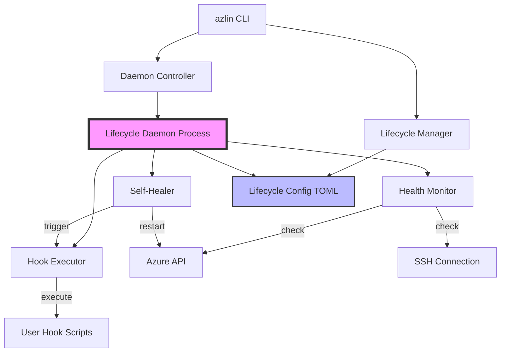

# VM Lifecycle Automation - Architecture Design

## Overview

This document specifies the architecture for automated VM lifecycle management in azlin, implementing health monitoring, self-healing, and lifecycle event hooks.

## System Architecture



## Core Modules (Bricks)

### 1. Lifecycle Manager (`lifecycle_manager.py`)

**Responsibility**: Configuration and daemon lifecycle management

**Public API (Studs)**:
```python
class LifecycleManager:
    def enable_monitoring(self, vm_name: str, config: MonitoringConfig) -> None
    def disable_monitoring(self, vm_name: str) -> None
    def get_monitoring_status(self, vm_name: str) -> MonitoringStatus
    def update_config(self, vm_name: str, config: MonitoringConfig) -> None
```

**Configuration Schema** (`~/.azlin/lifecycle-config.toml`):
```toml
[vms.my-vm]
enabled = true
check_interval_seconds = 60
restart_policy = "never"  # never | always | on-failure
ssh_failure_threshold = 3
health_check_timeout = 30

[vms.my-vm.hooks]
on_start = "/path/to/script.sh"
on_stop = ""
on_failure = ""
on_restart = ""
on_destroy = ""
on_healthy = ""

[daemon]
pid_file = "~/.azlin/lifecycle-daemon.pid"
log_file = "~/.azlin/lifecycle-daemon.log"
log_level = "INFO"
```

### 2. Lifecycle Daemon (`lifecycle_daemon.py`)

**Responsibility**: Background monitoring process

**Public API**:
```python
class LifecycleDaemon:
    def start(self) -> None
    def stop(self) -> None
    def reload_config(self) -> None
    def get_status(self) -> DaemonStatus
```

**Architecture**:
- Single background process using daemon library or multiprocessing
- Monitoring loop with configurable intervals
- Graceful shutdown on SIGTERM
- PID file for process management
- Logging to `~/.azlin/lifecycle-daemon.log`

### 3. Health Monitor (`health_monitor.py`)

**Responsibility**: VM health checking

**Public API**:
```python
class HealthMonitor:
    def check_vm_health(self, vm_name: str) -> HealthStatus
    def get_vm_state(self, vm_name: str) -> VMState
    def check_ssh_connectivity(self, vm_name: str) -> bool
    def get_metrics(self, vm_name: str) -> VMMetrics
```

**Health Checks**:
1. **VM State** (Azure API): Running, Stopped, Deallocated
2. **SSH Connectivity**: TCP connection test
3. **Basic Metrics** (SSH): CPU, Memory, Disk (optional, only if SSH works)

**Failure Thresholds**:
- SSH failures counted
- Threshold configurable per VM (default: 3)
- Reset on successful check

### 4. Self-Healer (`self_healer.py`)

**Responsibility**: Automatic recovery actions

**Public API**:
```python
class SelfHealer:
    def handle_failure(self, vm_name: str, failure: HealthFailure) -> None
    def restart_vm(self, vm_name: str) -> RestartResult
    def should_restart(self, vm_name: str, failure: HealthFailure) -> bool
```

**Restart Logic**:
- Check restart policy
- Verify failure threshold met
- Execute restart via Azure API
- Trigger `on_restart` hook
- Reset failure counter on success

**Policies**:
- `never`: No automatic restart (default, safe)
- `on-failure`: Restart after threshold SSH failures
- `always`: Restart on any health check failure (aggressive)

### 5. Hook Executor (`hook_executor.py`)

**Responsibility**: Execute user-defined lifecycle hooks

**Public API**:
```python
class HookExecutor:
    def execute_hook(self, hook_type: HookType, vm_name: str, context: dict) -> HookResult
    def validate_hook_script(self, script_path: str) -> bool
```

**Hook Types**:
- `on_start`: VM started
- `on_stop`: VM stopped
- `on_failure`: Health check failed
- `on_restart`: VM auto-restarted
- `on_destroy`: VM deleted
- `on_healthy`: VM passed health check

**Execution**:
- Runs on local machine (not VM)
- Environment variables provided:
  - `AZLIN_VM_NAME`
  - `AZLIN_EVENT_TYPE`
  - `AZLIN_TIMESTAMP`
  - `AZLIN_FAILURE_COUNT` (for on_failure)
- Timeout: 60 seconds default
- Non-blocking (daemon doesn't wait)

### 6. Daemon Controller (`daemon_controller.py`)

**Responsibility**: CLI interface for daemon operations

**Public API**:
```python
class DaemonController:
    def start_daemon(self) -> None
    def stop_daemon(self) -> None
    def restart_daemon(self) -> None
    def daemon_status(self) -> DaemonStatus
```

## Integration Points

### 1. CLI Commands

**New Commands**:
```bash
azlin lifecycle enable <vm-name>      # Enable monitoring
azlin lifecycle disable <vm-name>     # Disable monitoring
azlin lifecycle status [vm-name]      # Show monitoring status
azlin lifecycle daemon start          # Start daemon
azlin lifecycle daemon stop           # Stop daemon
azlin lifecycle daemon status         # Daemon status
azlin lifecycle daemon logs           # Show logs
```

**Modified Commands**:
```bash
azlin list                            # Add health column
azlin status                          # Add health section
```

### 2. `azlin list` Integration

**Modified Output**:
```
SESSION  VM NAME     STATUS    IP          REGION   SIZE       HEALTH
proj1    vm-001      Running   1.2.3.4     eastus   D2s_v3     Healthy ✓
proj2    vm-002      Running   1.2.3.5     westus   D2s_v3     Unhealthy (SSH down) ✗
-        vm-003      Stopped   N/A         eastus   B2s        N/A
```

**Implementation**:
- Read `~/.azlin/lifecycle-config.toml`
- Query daemon for real-time health (if running)
- Fallback to "N/A" if daemon not running

### 3. `azlin status` Integration

**New Section**:
```
Lifecycle Monitoring:
  Enabled: Yes
  Policy: on-failure
  Check Interval: 60s
  SSH Failures: 0/3
  Last Check: 2 minutes ago
  Last Status: Healthy ✓

  Hooks:
    on_failure: /home/user/scripts/alert.sh
    on_restart: /home/user/scripts/notify.sh
```

## Data Models

```python
@dataclass
class MonitoringConfig:
    enabled: bool
    check_interval_seconds: int = 60
    restart_policy: str = "never"
    ssh_failure_threshold: int = 3
    health_check_timeout: int = 30
    hooks: dict[str, str] = field(default_factory=dict)

@dataclass
class HealthStatus:
    vm_name: str
    state: str  # running, stopped, deallocated
    ssh_reachable: bool
    ssh_failures: int
    last_check: datetime
    metrics: VMMetrics | None

@dataclass
class VMMetrics:
    cpu_percent: float | None
    memory_percent: float | None
    disk_percent: float | None

@dataclass
class DaemonStatus:
    running: bool
    pid: int | None
    uptime: timedelta | None
    monitored_vms: list[str]
```

## Implementation Phases

### Phase 1: Core Infrastructure (MVP)
1. Lifecycle Manager (config CRUD)
2. Daemon Controller (start/stop/status)
3. Basic daemon process
4. Health Monitor (VM state + SSH only)
5. CLI commands skeleton

**Deliverable**: Can enable monitoring, start daemon, see basic health

### Phase 2: Self-Healing
1. Self-Healer implementation
2. Restart policy logic
3. Failure threshold tracking
4. Integration with daemon loop

**Deliverable**: Automatic restart works

### Phase 3: Hooks System
1. Hook Executor
2. Environment variable passing
3. Timeout handling
4. Hook validation

**Deliverable**: Basic hooks (on_start, on_stop, on_failure) work

### Phase 4: Integration
1. Modify `azlin list` for health column
2. Modify `azlin status` for health section
3. Advanced hooks (on_restart, on_destroy, on_healthy)
4. Metrics collection (CPU/mem/disk via SSH)

**Deliverable**: Fully integrated with azlin

### Phase 5: Polish
1. Comprehensive error handling
2. Logging improvements
3. Documentation
4. Testing coverage >75%

## Testing Strategy

### Unit Tests (60%)
- `test_lifecycle_manager.py`: Config CRUD operations
- `test_health_monitor.py`: Health checking logic (mocked Azure/SSH)
- `test_self_healer.py`: Restart decision logic
- `test_hook_executor.py`: Hook execution with mocks
- `test_daemon_controller.py`: Daemon management

### Integration Tests (30%)
- `test_daemon_integration.py`: Full daemon lifecycle
- `test_health_workflow.py`: Health check → failure → restart flow
- `test_hook_workflow.py`: Hook execution end-to-end
- `test_cli_integration.py`: CLI commands with daemon

### E2E Tests (10%)
- `test_full_lifecycle.py`: Create VM, enable monitoring, trigger failure, verify restart
- Manual testing documented in test plan

## Security Considerations

1. **Hook Scripts**:
   - Validate script path exists
   - Check execute permissions
   - Run with user's permissions (not elevated)
   - Log all hook executions

2. **Daemon**:
   - PID file secured (0600)
   - Log file secured (0600)
   - Daemon runs as user (not root)
   - Graceful shutdown on signals

3. **Configuration**:
   - Config file secured (0600)
   - Input validation on all config fields
   - No secrets in config (Azure creds from SDK)

4. **SSH Checks**:
   - Use existing azlin SSH key
   - Timeout all SSH operations
   - No password auth

## Success Criteria

- [x] Architecture designed
- [ ] Health monitoring daemon works (60s intervals)
- [ ] Automatic restart triggers after 3 SSH failures
- [ ] Basic hooks work (on_start, on_stop, on_failure)
- [ ] Health status visible in `azlin list`
- [ ] Health status visible in `azlin status`
- [ ] Config persists in `~/.azlin/lifecycle-config.toml`
- [ ] Tests coverage >75%
- [ ] CI passes
- [ ] Documentation complete

## Open Questions

1. **Daemon Management**: Use systemd/launchd or simple background process?
   - **Decision**: Start with simple background process (multiprocessing), defer systemd integration

2. **Notification**: Desktop notifications for health events?
   - **Decision**: Phase 6 (post-MVP), use platform-specific notify

3. **Metrics Storage**: Historical health data?
   - **Decision**: Not MVP, consider SQLite in Phase 6

## References

- azlin codebase: `src/azlin/`
- Configuration pattern: `src/azlin/config_manager.py`
- CLI pattern: `src/azlin/commands/`
- Module pattern: `src/azlin/modules/`
