# Feature #9: VM Health Dashboard - Architecture Diagram

This document provides visual diagrams for the VM Health Dashboard architecture.

---

## 1. System Architecture Overview


---

## 2. Health Scoring Flow

```mermaid
flowchart TD
    Start[Fetch VM Metrics] --> GetMetrics[Azure Monitor API]
    GetMetrics --> CPU[CPU %]
    GetMetrics --> Memory[Memory %]
    GetMetrics --> Network[Network %]
    GetMetrics --> Disk[Disk IOPS]

    CPU --> CPUScore{Score CPU}
    Memory --> MemScore{Score Memory}
    Network --> NetScore{Score Network}
    Disk --> DiskScore{Score Disk}

    CPUScore -->|<80%| Green1[GREEN]
    CPUScore -->|80-95%| Yellow1[YELLOW]
    CPUScore -->|>95%| Red1[RED]

    MemScore -->|<80%| Green2[GREEN]
    MemScore -->|80-90%| Yellow2[YELLOW]
    MemScore -->|>90%| Red2[RED]

    NetScore -->|<80%| Green3[GREEN]
    NetScore -->|80-95%| Yellow3[YELLOW]
    NetScore -->|>95%| Red3[RED]

    DiskScore -->|<85%| Green4[GREEN]
    DiskScore -->|85-95%| Yellow4[YELLOW]
    DiskScore -->|>95%| Red4[RED]

    Green1 & Yellow1 & Red1 --> Aggregate[Worst Signal Wins]
    Green2 & Yellow2 & Red2 --> Aggregate
    Green3 & Yellow3 & Red3 --> Aggregate
    Green4 & Yellow4 & Red4 --> Aggregate

    Aggregate --> Overall{Overall Health}
    Overall -->|Any RED| FinalRed[🔴 CRITICAL]
    Overall -->|Any YELLOW| FinalYellow[🟡 WARNING]
    Overall -->|All GREEN| FinalGreen[🟢 HEALTHY]

    style FinalRed fill:#f44336,color:#fff
    style FinalYellow fill:#ff9800,color:#000
    style FinalGreen fill:#4caf50,color:#fff
```



---

## 3. Component Hierarchy


---

## 4. Data Flow & Caching


---

## 5. Four Golden Signals Mapping


---

## 6. Mobile UI Flow

```mermaid
stateDiagram-v2
    [*] --> Dashboard: Open App
    Dashboard --> VMCard: View VMs
    VMCard --> QuickActions: Swipe Left
    VMCard --> DetailView: Tap Card
    VMCard --> Favorite: Long Press

    DetailView --> TimeRange: Select Range
    TimeRange --> DetailView: Update Charts
    DetailView --> Comparison: View Historical
    Comparison --> DetailView: Back

    QuickActions --> Restart: Tap Restart
    QuickActions --> Stop: Tap Stop
    QuickActions --> Logs: View Logs

    Dashboard --> Filtered: Apply Filter
    Filtered --> Dashboard: Clear Filter

    DetailView --> Dashboard: Back Button
    Restart --> Dashboard: Action Complete
    Stop --> Dashboard: Action Complete
    Logs --> Dashboard: Back

    note right of Dashboard
        Fleet Summary
        🟢 3 Healthy
        🟡 1 Warning
        🔴 0 Critical
    end note

    note right of DetailView
        Full Metrics
        - CPU/Memory/Disk/Net
        - Time-series charts
        - Anomaly detection
    end note
```



---

## 7. Redux State Structure

```typescript
// Visualized as diagram
interface HealthState {
  // VM health data keyed by VM ID
  vms: {
    "vm-1": VMHealthInfo,
    "vm-2": VMHealthInfo,
    "vm-3": VMHealthInfo,
  },

  // UI state
  loading: boolean,
  error: string | null,

  // Cache metadata
  lastRefresh: "2026-01-19T10:30:00Z",
  autoRefreshEnabled: true,
  refreshInterval: 60, // seconds

  // Filters
  filters: {
    healthStatus: 'all' | 'healthy' | 'warning' | 'critical',
    resourceGroup: 'all' | 'specific-rg',
    sortBy: 'health' | 'name' | 'lastUpdated',
  }
}
```

**Diagram**:


---

## 8. API Integration Pattern


---

## 9. Error Handling Flow


---

## 10. Performance Optimization Strategy


---

## 11. Testing Pyramid


---

## Summary

These diagrams provide a comprehensive visual guide to the VM Health Dashboard architecture:

1. **System Architecture**: High-level component interaction
2. **Health Scoring Flow**: Decision tree for health calculation
3. **Component Hierarchy**: UI component structure
4. **Data Flow**: Caching and API integration
5. **Four Golden Signals**: Metric mapping
6. **Mobile UI Flow**: User interaction states
7. **Redux State**: Data structure
8. **API Integration**: Sequence diagram
9. **Error Handling**: Recovery strategies
10. **Performance**: Optimization layers
11. **Testing**: Test pyramid

**Next Steps**: Review these diagrams alongside the main design spec (`FEATURE_9_VM_HEALTH_DASHBOARD_DESIGN.md`) before implementation.

---

**Version**: 1.0
**Date**: 2026-01-19
**Status**: Complete

Arrr matey! These diagrams chart the course for yer VM Health Dashboard implementation! 🏴‍☠️
